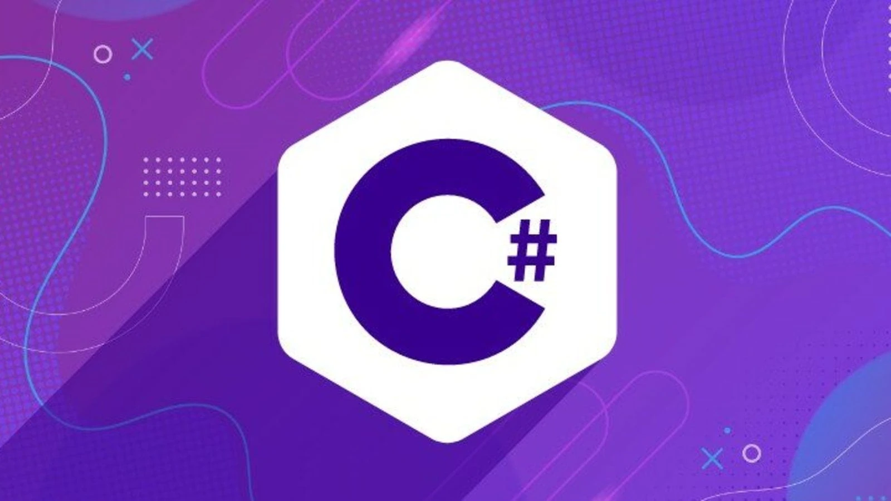

# 🧩 C# Cheat Sheet — Modern Essentials (.NET 6+)



## 🚀 Basic Program
```csharp
using System;

class Program
{
    static void Main()
    {
        Console.WriteLine("Hello C#!");
    }
}
```

## 📦 Variables & Types
```csharp
int x = 10;
var y = 20;        // inferred type
const double PI = 3.14;
string name = "Shashank";
bool active = true;
```

## 🔢 Common Types
```csharp
int, long, float, double, decimal
string, bool, char
List<T>, Dictionary<K,V>
DateTime, TimeSpan
```

## 🧱 Strings
```csharp
string s = "hello";
string sub = s.Substring(0, 3);
string joined = string.Join(",", new[] { "a", "b" });

$"{name} is {x} years old"   // interpolated string
```

## 🔁 Loops
```csharp
for (int i=0; i<5; i++) {}
while (x < 5) { x++; }
do { } while (x < 5);

foreach (var item in list) {}
```

## 🧩 Conditionals
```csharp
if (x > 5) {}
else if (x == 5) {}
else {}

switch (val)
{
    case 1: break;
    case 2: break;
    default: break;
}
```

## 🧮 Functions / Methods
```csharp
int Add(int a, int b) => a + b;

void Greet(string name = "User")
{
    Console.WriteLine($"Hi {name}");
}
```

## 🗂️ Arrays & Lists
```csharp
int[] arr = { 1, 2, 3 };

List<int> list = new List<int>();
list.Add(1);
list.AddRange(new []{2,3});
```

## 📦 Dictionaries
```csharp
var map = new Dictionary<string, int>();
map["a"] = 1;
map.Add("b", 2);
```

## 🔧 OOP Basics
```csharp
class User
{
    public string Name { get; set; }
    public int Age { get; set; }

    public void Greet() => Console.WriteLine($"Hi, I'm {Name}");
}

var u = new User { Name="Bob", Age=20 };
u.Greet();
```

## 🧱 Constructors
```csharp
class Point
{
    public int X, Y;
    public Point(int x, int y)
    {
        X = x; Y = y;
    }
}
```

## 🔗 Inheritance
```csharp
class Animal 
{
    public virtual void Speak() => Console.WriteLine("noise");
}

class Dog : Animal
{
    public override void Speak() => Console.WriteLine("woof");
}
```

## 🧩 Interfaces
```csharp
interface IShape 
{
    double Area();
}
```

## 🧵 Async / Await
```csharp
async Task Fetch()
{
    var response = await http.GetStringAsync("https://api.example.com");
    Console.WriteLine(response);
}
```

## 🔥 LINQ (God-tier feature)
```csharp
var evens = list.Where(n => n % 2 == 0).ToList();
var sum = list.Sum();
var first = list.FirstOrDefault();
```

## 🧨 Exceptions
```csharp
try 
{
    throw new Exception("oops");
} 
catch (Exception ex) 
{
    Console.WriteLine(ex.Message);
}
```

## 📁 File I/O
```csharp
File.WriteAllText("a.txt", "hello");
string text = File.ReadAllText("a.txt");
```

## 🌐 HTTP (HttpClient)
```csharp
var client = new HttpClient();
string result = await client.GetStringAsync(url);
```

## 🛠️ .NET Tools
```bash
dotnet new console
dotnet run
dotnet build
dotnet add package PackageName
```

